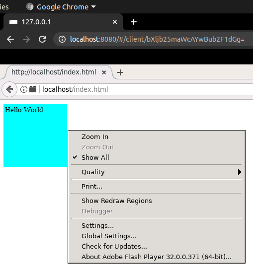

# Play Adobe Flash After EOL

The base image is the powerful [linuxserver/docker-baseimage-guacgui](https://github.com/linuxserver/docker-baseimage-guacgui) which interested me to create a container for old Flash. Without the ability to access an inner browser or other GUI application directly in browser, it is not so attractive to do these work.


  
Firefox running in Docker accessible in Chrome

  
Standalone Flash player running in Docker accessible in Chrome

## Usage

A simple command is:
```
docker run -p 8080:8080 --name play-adobe-flash-after-eol jchprj/play-adobe-flash-after-eol
```

There are some customizable settings:

### Remote desktop

Just expose 3389 port

### Run Chrome/Firefox/standalone Flash player

Use environment variable: `STARTUP`, the value is a whole command, for example:
```
docker run -e "STARTUP=firefox http://localhost/index.html" -p 8080:8080 --name play-adobe-flash-after-eol jchprj/play-adobe-flash-after-eol
```

The value of `STARTUP` could be one of the following commands(if need open any URL by default, just add the URL to the end of the line):
```
flashplayer
flashplayerdebugger
google-chrome --no-sandbox
```

Another way is to mount the `/startup` folder, and provide a different `start.sh`, it will be executed at the beginning.

WARNING: Don't use the `STARTUP` while mounting the `/startup` folder as the internal mechanism is write the value of `STARTUP` to `/startup/start.sh` which will override the outside file mounted to the folder. Until find a better way.


### HTTP server

There is a light HTTP server running in the container and serve `/flash` folder. Just mount this folder could run any contents outside the container. 

The purpose of the HTTP server is standalone Flash player disabled loading local content by default and hard to be set in advance using Docker, so a http server is running in the container to support open content in `http://localhost`


## Other

If you want to compile `.swf` from source, another Docker image([jchprj/docker-flex-4.6-sdk-ant](https://hub.docker.com/r/jchprj/docker-flex-4.6-sdk-ant)) I created years ago could be used, for example:
```
docker run -v ${PWD}:/flash -it --rm jchprj/docker-flex-4.6-sdk-ant mxmlc /flash/HelloWorld.as
```


## About versions

### Chrome

Chrome 64-bit 53.0.2785.116 is the latest version that have no EOL time limit. After this version, if run after EOL, will not allow to play Flash.

The accompanied Flash Player version inside this Chrome is 23.0.0.162, unfortunately it will crush when I run some 3D Flash contents. So Firefox maybe a better choice.

### Firefox

Firefox 64-bit does not have such early time limit as Chrome, even version 84.0 allow play Flash, but 53.0.3 is the latest version I tested for some 3D contents, so I used this version in `master` branch. Will use other version in other branches.

### Firefox used Flash Player

32.0.0.371 is the latest version that has no time limit.

### Standalone Flash Player
No time limitation, officially allow to use after EOL, so use the latest version: 32.0.0.465(downloaded from Adobe).


## References

### Downloads for different versions

* Chrome: https://www.slimjet.com/chrome/google-chrome-old-version.php  
Chrome does not offer official old version download according to [browser - How can I download an old version of Google Chrome - Super User](https://superuser.com/questions/1381356/how-can-i-download-an-old-version-of-google-chrome).
* Firefox: https://ftp.mozilla.org/pub/firefox/releases/  
This is the official Firefox old versions.
* Flash Player: https://archive.org/download/flashplayerarchive/pub/flashplayer/installers/archive/
Adobe does not offer official old version download([annoucement](https://www.adobe.com/products/flashplayer/end-of-life.html)), only leave the standalone player downloadable officially([link](https://www.adobe.com/support/flashplayer/debug_downloads.html))